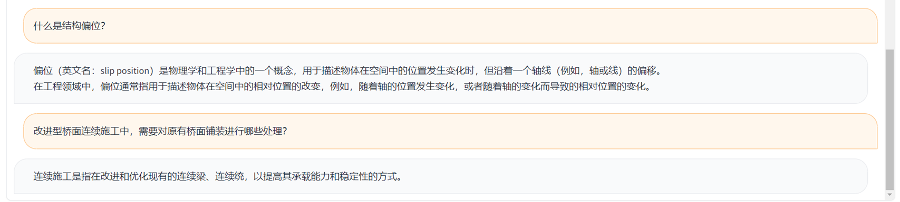

# BridgeGPT
## 简介
面向桥梁管养领域，BridgeGPT通过增量预训练和轻量化指令微调方法将桥梁管养领域相应知识注入至ChatGLM-2-6B模型，初步实现了桥梁管养领域智能问答和推理目标，可以为桥梁管养人员或公司提供管养常识，并应用至多个管养场景。

注：如需商用，需填写ChatGLM官方[问卷](https://open.bigmodel.cn/mla/form)，获得许可后方可使用

## 示例
原始ChatGLM模型输出

BridgeGPT模型输出


## DEMO使用

## 模型下载

ChatGLM模型完整参数可在HuggingFace[官网](https://huggingface.co/THUDM/chatglm2-6b)获取

### 所需第三方库及版本
```txt
pytorch==1.13.1+cu116
transformer==4.31.0
bitsandbytes==0.39.0
gradio==3.37.0
```

### 使用
```shell
./web_demo.sh
```

## 声明
当前模型处于迭代升级过程中，仍存在多种常识性错误，仅作为学术分享与交流使用，在使用时出现的各种错误、风险和问题，我们将不承担任何责任。